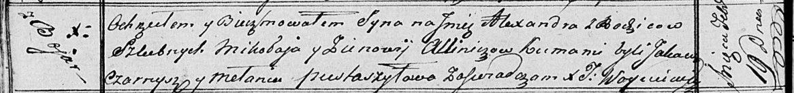

**Аллинич Александр Миколаев (Allinicz Alexander)**

19 февраля 1817 г -- крещение (НИАБ 136-13-894, лист 95об, №13/1817-р
(ориг)).

**НИАБ 136-13-896:** Лист 95об. **Метрическая запись №13/1817-р
(ориг).**

Осовская Покровская церковь. 19 февраля 1817 года. Метрическая запись о
крещении.

Allinicz Alexander -- сын родителей с деревни Бояры.

Allinicz Mikolay -- отец.

Alliniczowa Zienowija -- мать.

Czarnysz Jakaw -- кум.

Pustaszylowa Mełania -- кума.

Woyniewicz Tomasz -- ксёндз.
