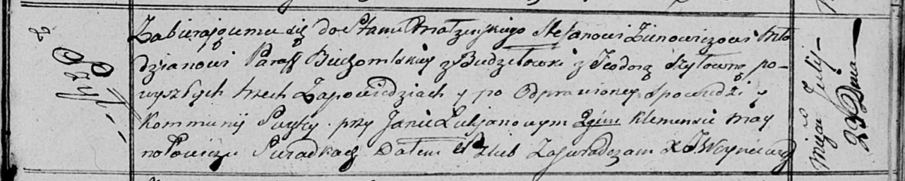

**Зенович Стефан (Zienowicz Stefan)**

23 июля 1817 г -- венчание с Тодорой Шило с деревни Шилы (НИАБ
136-13-920, лист 24, №4/1817-б (ориг)).

**НИАБ 136-13-920:** Лист 24. **Метрическая запись №4/1817-б (ориг).**

Осовская Покровская церковь. 23 июля 1817 года. Запись о венчании.

Zienowicz Stefan -- жених, молодой, парафии Бегомльской, с застенка
Будочи.

Szyłowna Teodora -- невеста, с деревни Шилы.

Łukjanow Jan -- свидетель.

Maynołowicz Klemens -- свидетель.

Woyniewicz Tomasz -- ксёндз.
