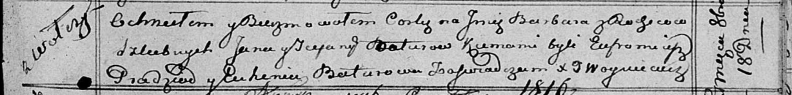

**Батура Стефана (Baturowa Scefana)**

18 октября 1815 г -- крещение дочери Варвары (НИАБ 136-13-894, лист 93,
№39/1815-р (ориг)).

**НИАБ 136-13-894:** Лист 93. **Метрическая запись №39/1815-р (ориг).**

Осовская Покровская церковь. 18 октября 1815 года. Метрическая запись о
крещении.

Baturowna Barbara -- дочь родителей с деревни Волча.

Batura Jan -- отец.

Baturowa Scefana -- мать.

Pradzad Eufromiacz -- кум.

Baturowa Euhenia -- кума.

Woyniewicz Tomasz -- ксёндз.
