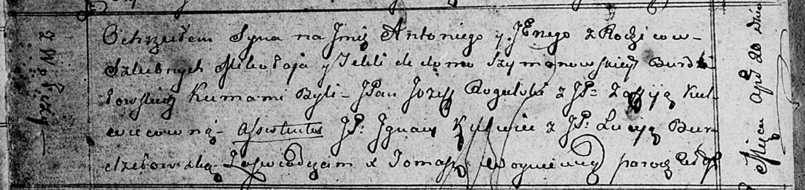

**Бурдзиловский Антоний Миколаев, шляхтич (Burdziłowski Antony Jerzy)**

20 апреля 1813 г -- крещение (НИАБ 136-13-894, лист 86об, №11/1813-р
(ориг)).

**НИАБ 136-13-894:** Лист 86об. **Метрическая запись №11/1813-р
(ориг).**

Осовская Покровская церковь. 20 апреля 1813 года. Метрическая запись о
крещении.

Burdziłowski Antony Jerzy -- сын родителей с деревни Волчи.

Burdziłowski Mikołay -- отец.

Burdziłowaska z Szymanowskich Tekla -- мать.

Rogulski Jozef, JP -- кум, шляхтич.

Kulwiecowna Zofija, JP -- кума, шляхтянка.

Kulwiec Jgnacy, JP -- ассистент, шляхтич.

Burdziłowska Lucija, JP -- ассистентка, шляхтянка.

Woyniewicz Tomasz -- ксёндз.
