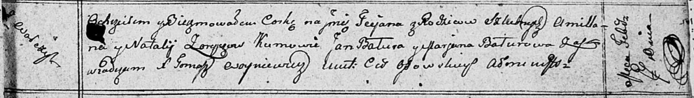

**Зорич Наталья (Zoryczowa Natalla)**

7 февраля 1811 г -- крещение дочери Татьяны (НИАБ 136-13-894, лист 80,
№9/1811-р (ориг)).

**НИАБ 136-13-894:** Лист 80. **Метрическая запись №9/1811-р (ориг).**

Осовская Покровская церковь. 7 февраля 1811 года. Метрическая запись о
крещении.

Zoryczowna Taciana -- сын родителей с деревни Волча.

Zorycz Amillan -- отец.

Zoryczowa Natalja -- мать.

Batura Jan -- кум.

Baturowa Marjana -- кума.

Woyniewicz Tomasz -- ксёндз.
