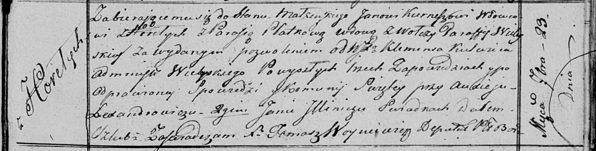

**Курнеш (в предыдущем браке Плотко) Парася (Kurneszowa (Płotkowa)
Parasia)**

23 сентября 1817 г -- венчание с вдовцом Яном Курнешом с деревни Горелое
(НИАБ 136-13-920, лист 24, №5/1817-б (ориг)).

**НИАБ 136-13-920:** Лист 24. **Метрическая запись №5/1817-б (ориг).**

Осовская Покровская церковь. 23 сентября 1817 года. Запись о венчании.

Kurnesz Jan -- жених, вдовец, парафии Осовской, с деревни Горелое.

Płоtkowa Parasia -- невеста, вдова, парафии Вилейской, с деревни Волчи.

Kulwic Klemens, WJP -- разрешил брак, администратор Вилейский.

Lexandrowicz Audiey -- свидетель.

Jllinicz Jan -- свидетель.

Woyniewicz Tomasz -- ксёндз.
