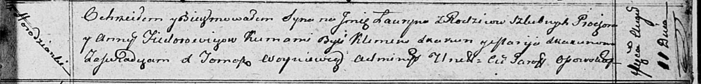
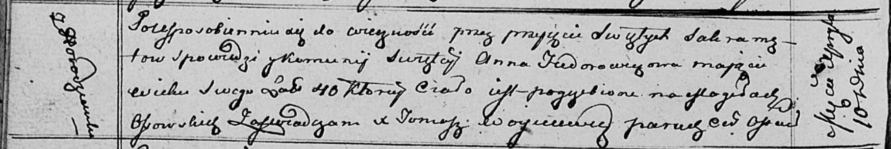

**Федорович Анна (Fiedorowiczowa Anna)**

11 августа 1812 г -- крещение сына Лаврына (НИАБ 136-13-894, лист 85,
№39/1812-р (ориг)).

10 апреля 1813 г -- отпевание, умерла в возрасте 40 лет (родилась около
1773 г) (НИАБ 136-13-919, лист 26об, №35/1813-у (ориг)).

**НИАБ 136-13-894:** Лист 85. **Метрическая запись №39/1812-р (ориг).**

Осовская Покровская церковь. 11 августа 1812 года. Метрическая запись о
крещении.

Fiedorowicz Łauryn -- сын родителей с деревни Городянка.

Fiedorowicz Prochor -- отец.

Fiedorowiczowa Anna -- мать.

Skakun Klemens -- кум.

Skakunowa Marija -- кума.

Woyniewicz Tomasz -- ксёндз.

**НИАБ 136-13-919:** Лист 26об. **Метрическая запись №35/1813-у
(ориг).**

Осовская униатская церковь. 10 апреля 1813 года. Метрическая запись об
отпевании.

Fiedorowiczowa Anna -- умершая, 40 лет, с деревни Городзянка, похоронена
на кладбище деревни Осово.

Woyniewicz Tomasz -- ксёндз.
