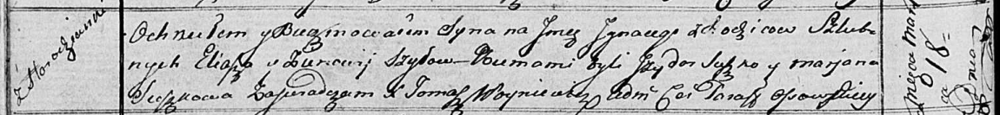

**Шило Игнацы Ильин (Szyło Jhnacy)**

18 марта 1817 г -- крещение (НИАБ 136-13-894, лист 95об, №18/1817-р
(ориг)).

**НИАБ 136-13-894:** Лист 95об. **Метрическая запись №18/1817-р
(ориг).**

{width="6.496527777777778in"
height="0.7516371391076115in"}

Осовская Покровская церковь. 18 марта 1817 года. Метрическая запись о
крещении.

Szyło Jhnacy -- сын родителей с деревни Городянка.

Szyło Eliasz -- отец.

Szyłowa Zienowija -- мать.

Suszko Jzydor -- кум.

Suszkowa Marjana -- кума.

Woyniewicz Tomasz -- ксёндз.
