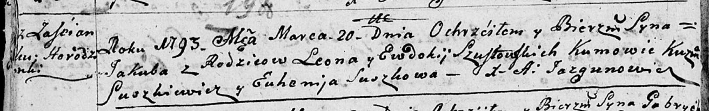
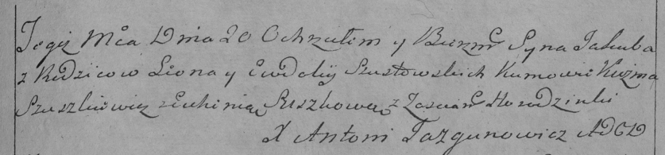

**Шустовский Якуб Леонов (Szustowski Jakub)**

20 марта 1793 г -- крещение (НИАБ 136-13-894, лист 19об, №32/1793-р
(ориг)), (РГИА 823-2-18, лист 246об, №11/1793-р (коп)).

**НИАБ 136-13-894:** Лист 19-об. **Метрическая запись №32/1793-р
(ориг).**

Дедиловичская Покровская церковь. 20 марта 1793 года. Метрическая запись
о крещении.

Szustowski Jakub -- сын родителей с застенка Городёнка.

Szustowski Leon -- отец.

Szustowska Ewdokija -- мать.

Suszkiewicz Kuźma - кум.

Suszkowa Euhenija - кума.

Jazgunowicz Antoni -- ксёндз.

**РГИА 823-2-18:** Лист 247. **Метрическая запись №12/1793-р (коп).**

Дедиловичская Покровская церковь. 20 марта 1793 года. Метрическая запись
о крещении.

Szustowski Jakub -- сын родителей с застенка Городянка.

Szustowski Leon -- отец.

Szustowska Ewdokija -- мать.

Szuszkiewicz Kużma -- кум.

Suszkowa Euhenia -- кума.

Jazgunowicz Antoni -- ксёндз.
