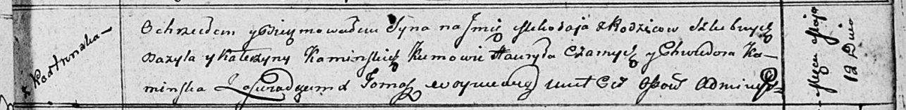

**Каминский Миколай Базылев (Kaminski Mikołay)**

12 мая 1811 г -- крещение (НИАБ 136-13-894, лист 81, №23/1811-р (ориг)).

**НИАБ 136-13-894:** Лист 81. **Метрическая запись №23/1811-р (ориг).**

{width="6.496527777777778in"
height="0.7985717410323709in"}

Осовская Покровская церковь. 12 мая 1811 года. Метрическая запись о
крещении.

Kaminski Mikołay -- сын родителей с деревни Кострянска.

Kaminski Bazyli -- отец.

Kaminska Katerzyna -- мать.

Czarnysz Hauryła -- кум.

Kaminska Chwiedora -- кума.

Woyniewicz Tomasz -- ксёндз.
