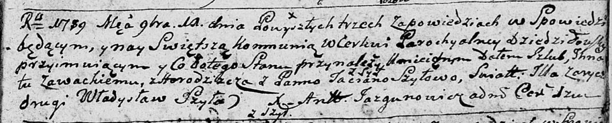

**Завацкая (Шило) Татьяна (Zawacka Taciana z Szył)**

11 ноября 1789 г -- венчание с Игнатом Завацким с деревни Городище (НИАБ
136-13-894, лист 68, №12/1789-б (ориг)).

**НИАБ 136-13-894:** Лист 68. **Метрическая запись №12/1789-б (ориг).**

Дедиловичская Покровская церковь. 11 ноября 1789 года. Метрическая
запись о венчании.

Zawacki Jhnat -- жених, с деревни Городище.

Szyłowa Taciana -- невеста, с деревни Шилы.

Zorycz Jlla -- свидетель.

Szyło Władysław -- свидетель.

Jazgunowicz Antoni -- ксёндз.
