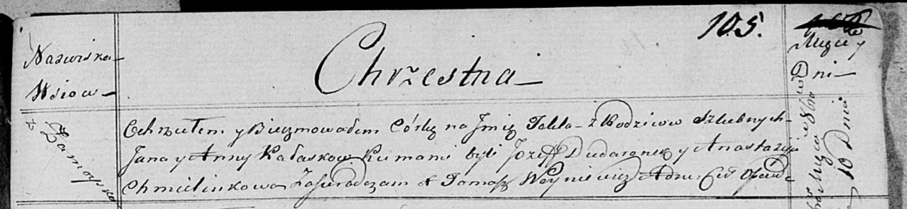

**Каласок Анна (Kałaskowa Anna)**

10 октября 1820 г -- крещение дочери Текли (НИАБ 136-13-894, лист 105,
№34/1820-р (ориг)).

**НИАБ 136-13-894:** Лист 105. **Метрическая запись №34/1820-р (ориг).**

{width="6.496527777777778in"
height="1.5032731846019247in"}

Осовская Покровская церковь. 10 октября 1820 года. Метрическая запись о
крещении.

Kałaskowna Tekla -- дочь родителей с деревни Замойск.

Kałasok Jan -- отец.

Kałaskowna Anna -- мать.

Dudaronek Jozef -- кум.

Chmielinkowa Anastazyja -- кума.

Woyniewicz Tomasz -- ксёндз.
