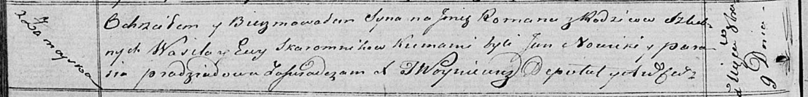

**Скаромник Роман Василев (Skaromnik Roman)**

9 октября 1820 г -- крещение (НИАБ 136-13-894, лист 104об, №32/1820-р
(ориг)).

**НИАБ 136-13-894:** Лист 104об. **Метрическая запись №32/1820-р
(ориг).**

Осовская Покровская церковь. 9 октября 1820 года. Метрическая запись о
крещении.

Skaromnik Roman -- сын родителей с деревни Замойск.

Skaromnik Wasil -- отец.

Skaromnikowa Ewa -- мать.

Nowicki Jan -- кум.

Pradziadowa Parasia -- кума.

Woyniewicz Tomasz -- ксёндз.
