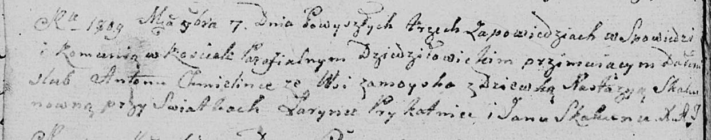

**Хмелинко Антон (Chmielinka Anton)**

7 ноября 1809 г -- венчание с девкой Настасьей Скакун (НИАБ 136-13-920,
лист 15об, №15/1809-б (ориг)).

**НИАБ 136-13-894:** Лист 15об. **Метрическая запись №15/1809-б
(ориг).**

{width="6.496527777777778in"
height="1.2920636482939634in"}

Дедиловичская Покровская церковь. 7 ноября 1809 года. Метрическая запись
о венчании.

Chmelinka Anton -- жених, с деревни Замойск.

Skakunowna Nastazya -- невеста, девка.

Prykatnia Łaryn -- свидетель.

Skakun Jan -- свидетель.

Jazgunowicz Antoni -- ксёндз.
