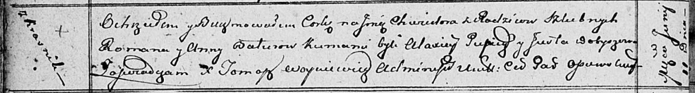

**Батуро Хведора Романова (Baturowna Chwiedora)**

11 июня 1812 г -- крещение (НИАБ 136-13-894, лист 84об, №27/1812-р
(ориг)).

**НИАБ 136-13-894:** Лист 84об. **Метрическая запись №27/1812-р
(ориг).**

Осовская Покровская церковь. 11 июня 1812 года. Метрическая запись о
крещении.

Baturowna Chwiedora -- дочь родителей с деревни Красники.

Batura Roman -- отец.

Baturowa Anna -- мать.

Pupicz? Alaxiey -- кум.

Dobyszewa Justa -- кума.

Woyniewicz Tomasz -- ксёндз.
