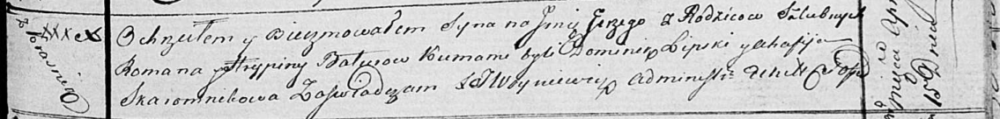

**Батуро Елена Романова (Baturowna Elena)**

25 июля 1811 г -- крещение (НИАБ 136-13-894, лист 81об, №37/1811-р
(ориг)).

**НИАБ 136-13-894:** Лист 81об. **Метрическая запись №37/1811-р
(ориг).**

{width="6.496527777777778in"
height="0.9246270778652669in"}

Осовская Покровская церковь. 25 июля 1811 года. Метрическая запись о
крещении.

Baturowna Elena -- дочь родителей с деревни Красники.

Baturo Roman -- отец.

Baturowa Rypina -- мать.

Lipalij? Adam -- кум.

Skoromkowa Anna -- кума.

Woyniewicz Tomasz -- ксёндз.
