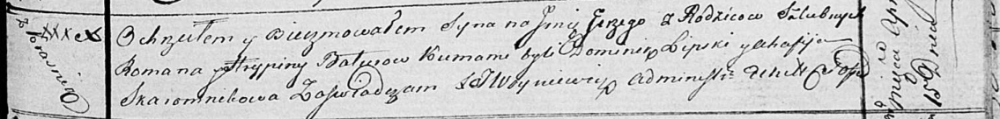

**Батуро Роман (Baturo Roman)**

25 июля 1811 г -- крещение дочери Елены (НИАБ 136-13-894, лист 81об,
№37/1811-р (ориг)).

15 апреля 1817 г -- крещение сына Юрия (НИАБ 136-13-894, лист 96,
№28/1817-р (ориг)).

**НИАБ 136-13-894:** Лист 81об. **Метрическая запись №37/1811-р
(ориг).**

{width="6.496527777777778in"
height="0.9246270778652669in"}

Осовская Покровская церковь. 25 июля 1811 года. Метрическая запись о
крещении.

Baturowna Elena -- дочь родителей с деревни Красники.

Baturo Roman -- отец.

Baturowa Rypina -- мать.

Lipalij? Adam -- кум.

Skoromkowa Anna -- кума.

Woyniewicz Tomasz -- ксёндз.

**НИАБ 136-13-894:** Лист 96. **Метрическая запись №28/1817-р (ориг).**

{width="6.496527777777778in"
height="0.7784569116360455in"}

Осовская Покровская церковь. 15 апреля 1817 года. Метрическая запись о
крещении.

Batura Jerzy -- сын родителей с деревни Красники.

Batura Roman -- отец.

Baturowa Hrypina -- мать.

Lipski Dominik -- кум.

Skaromnikowa Ahafija -- кума.

Woyniewicz Tomasz -- ксёндз.
