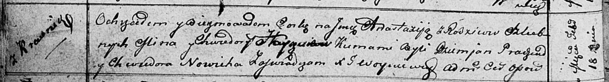

**Гайчук Анастасия Минова (Hayczukowna Anastazyja)**

18 февраля 1812 г -- крещение (НИАБ 136-13-894, лист 83об, №14/1812-р
(ориг)).

**НИАБ 136-13-894:** Лист 83об. **Метрическая запись №14/1812-р
(ориг).**

{width="6.496527777777778in"
height="0.8890901137357831in"}

Осовская Покровская церковь. 18 февраля 1812 года. Метрическая запись о
крещении.

Hayczukowna Anastazyja -- дочь родителей с деревни Красники.

Hayczuk Mina -- отец.

Hayczukowa Chwiedora -- мать.

Pradziad Dziemjan -- кум.

Nowicka Chwiedora -- кума.

Woyniewicz Tomasz -- ксёндз.
