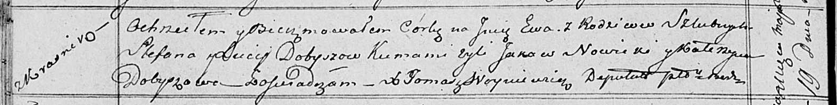

**Добыш Стефан (Dobysz Stefan)**

4 апреля 1815 г -- крещение дочери Марьи (НИАБ 136-13-894, лист 92об,
№22/1815-р (ориг)).

19 мая 1818 г -- крещение дочери Евы (НИАБ 136-13-894, лист 98об,
№16/1818-р (ориг)).

**НИАБ 136-13-894:** Лист 92об. **Метрическая запись №22/1815-р
(ориг).**

{width="6.496527777777778in"
height="1.5347867454068242in"}

Осовская Покровская церковь. 4 апреля 1815 года. Метрическая запись о
крещении.

Dobyszowna Marja -- дочь родителей с деревни Красники.

Dobysz Stefan -- отец.

Dobyszowa Lucija -- мать.

Nowicki Jakow -- кум.

Dobyszowa Katerzyna -- кума.

Woyniewicz Tomasz -- ксёндз.

**НИАБ 136-13-894:** Лист 98об. **Метрическая запись №16/1818-р
(ориг).**

{width="6.496527777777778in"
height="0.8152777777777778in"}

Осовская Покровская церковь. 19 мая 1818 года. Метрическая запись о
крещении.

Dobyszowna Ewa -- дочь родителей с деревни Красники.

Dobysz Stefan -- отец.

Dobyszewa Lucija -- мать.

Nowicki Jakow -- кум.

Dobyszowa Katerzyna -- кума.

Woyniewicz Tomasz -- ксёндз.
