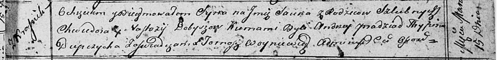

**Добыш Настасья (Dobyszowa Nastazya, Nastazyja)**

2 февраля 1811 г -- крещение дочери Полонии (НИАБ 136-13-894, лист 80,
№7/1811-р (ориг)).

15 марта 1813 г -- крещение сына Янки (НИАБ 136-13-894, лист 86,
№5/1813-р (ориг)).

**НИАБ 136-13-894:** Лист 80. **Метрическая запись №7/1811-р (ориг).**

{width="6.496527777777778in"
height="0.8622703412073491in"}

Осовская Покровская церковь. 2 февраля 1811 года. Метрическая запись о
крещении.

Dobyszowna Połonia -- дочь родителей с деревни Красники.

Dobysz Fiedor -- отец.

Dobyszowa Nastazya -- мать.

Pradziad Andrzey -- кум.

Dobyszowa Justyna -- кума.

Woyniewicz Tomasz -- ксёндз.

**НИАБ 136-13-894:** Лист 86. **Метрическая запись №5/1813-р (ориг).**

{width="6.496527777777778in"
height="0.7945494313210849in"}

Осовская Покровская церковь. 15 марта 1813 года. Метрическая запись о
крещении.

Dobysz Janka -- сын родителей с деревни Красники.

Dobysz Chwiedor -- отец.

Dobyszewa Nastazyja -- мать.

Pradziad Andrzey -- кум.

Dupczycha Hrypina -- кума.

Woyniewicz Tomasz -- ксёндз.
