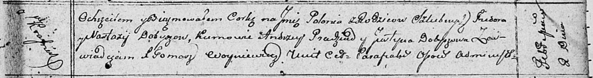

**Добыш Полония Федорова (Dobyszowna Połonia)**

2 февраля 1811 г -- крещение (НИАБ 136-13-894, лист 80, №7/1811-р
(ориг)).

**НИАБ 136-13-894:** Лист 80. **Метрическая запись №7/1811-р (ориг).**

Осовская Покровская церковь. 2 февраля 1811 года. Метрическая запись о
крещении.

Dobyszowna Połonia -- дочь родителей с деревни Красники.

Dobysz Fiedor -- отец.

Dobyszowa Nastazya -- мать.

Pradziad Andrzey -- кум.

Dobyszowa Justyna -- кума.

Woyniewicz Tomasz -- ксёндз.
