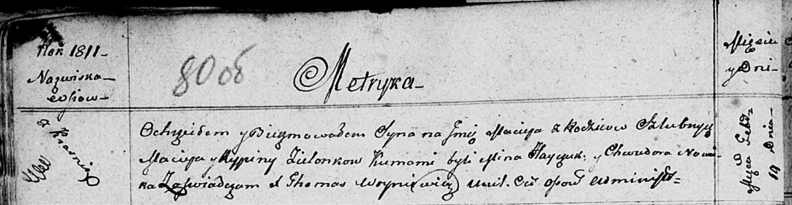

**Зелёнка Мацей Мацеев (Zielonka Maciey)**

14 февраля 1811 г -- крещение (НИАБ 136-13-894, лист 80об, №11/1811-р
(ориг)).

**НИАБ 136-13-894:** Лист 80об. **Метрическая запись №11/1811-р
(ориг).**

Осовская Покровская церковь. 14 февраля 1811 года. Метрическая запись о
крещении.

Zielonka Maciey -- сын родителей с деревни Красники.

Zielonka Maciey -- отец.

Zielonkowa Rypina -- мать.

Hayczuk Mina -- кум.

Nowicka Chwiedora -- кума.

Woyniewicz Tomasz -- ксёндз.
