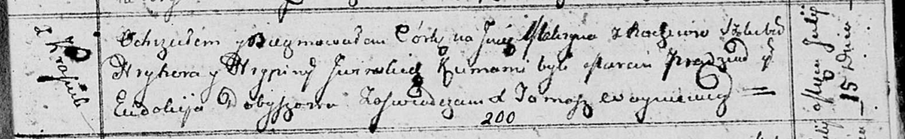

**Ивинская Грыпина (Jwinska Hrypina)**

15 июля 1813 г -- крещение дочери Макрыны (НИАБ 136-13-894, лист 87,
№20/1813-р (ориг)).

**НИАБ 136-13-894:** Лист 87. **Метрическая запись №20/1813-р (ориг).**

Осовская Покровская церковь. 15 июля 1813 года. Метрическая запись о
крещении.

Jwinska Makryna -- дочь родителей с деревни Красники.

Jwinski Hryhor -- отец.

Jwinska Hrypina -- мать.

Pradziad Marcin -- кум.

Dobyszowa Eudokija -- кума.

Woyniewicz Tomasz -- ксёндз.
