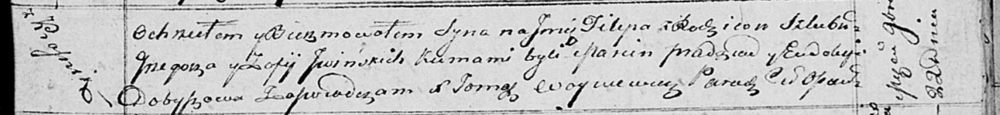

**Ивинская (в девичестве Дударёнок) София (Jwinska Zofia z Dudaronkow)**

7 ноября 1809 г -- венчание с Грыгором Ивинским с деревни Красники (НИАБ
136-13-920, лист 16, №20/1809-б (ориг)).

22 ноября 1814 г -- крещение сына Филипа (НИАБ 136-13-894, лист 91,
№67/1814-р (ориг)).

**НИАБ 136-13-920:** Лист 16. **Метрическая запись №20/1809-б (ориг).**

Дедиловичская Покровская церковь. 7 ноября 1809 года. Метрическая запись
о венчании.

Jwinski Hryszka -- жених, молодой с деревни Красники.

Dudaronkowa Zosia -- невеста, девка с деревни Замосточье.

Jwinski Jan -- свидетель.

Szyło Adam -- свидетель.

Jazgunowicz Antoni -- ксёндз.

**НИАБ 136-13-894:** Лист 91. **Метрическая запись №67/1814-р (ориг).**

Осовская Покровская церковь. 22 ноября 1814 года. Метрическая запись о
крещении.

Jwinski Filip -- сын родителей с деревни Красники.

Jwinski Grzegorz -- отец.

Jwinska Zofia -- мать.

Pradziad Marcin -- кум.

Dobyszowa Eudokija -- кума.

Woyniewicz Tomasz -- ксёндз.
