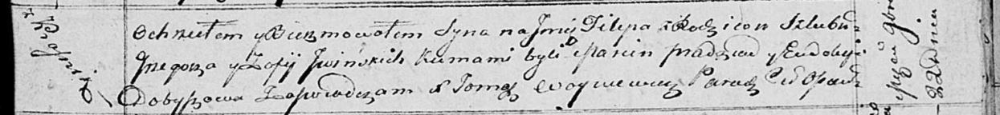

**Ивинский Филип Грыгоров (Jwinski Filip)**

22 ноября 1814 г -- крещение (НИАБ 136-13-894, лист 91, №67/1814-р
(ориг)).

**НИАБ 136-13-894:** Лист 91. **Метрическая запись №67/1814-р (ориг).**

{width="6.496527777777778in"
height="0.7516371391076115in"}

Осовская Покровская церковь. 22 ноября 1814 года. Метрическая запись о
крещении.

Jwinski Filip -- сын родителей с деревни Красники.

Jwinski Grzegorz -- отец.

Jwinska Zofia -- мать.

Pradziad Marcin -- кум.

Dobyszowa Eudokija -- кума.

Woyniewicz Tomasz -- ксёндз.
