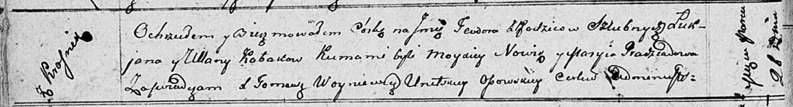

**Кабак Тодора Лукьянова (Kabakowna Teodora)**

21 марта 1811 г -- крещение (НИАБ 136-13-894, лист 80об, №15/1811-р
(ориг)).

**НИАБ 136-13-894:** Лист 80об. **Метрическая запись №15/1811-р
(ориг).**

{width="6.496527777777778in"
height="0.887749343832021in"}

Осовская Покровская церковь. 21 марта 1811 года. Метрическая запись о
крещении.

Kabakowna Teodora -- дочь родителей с деревни Красники.

Kabak Łukjan -- отец.

Kabakowa Ullana -- мать.

Nowik Moysiey -- кум.

Pradziadowa Maryja -- кума.

Woyniewicz Tomasz -- ксёндз.
