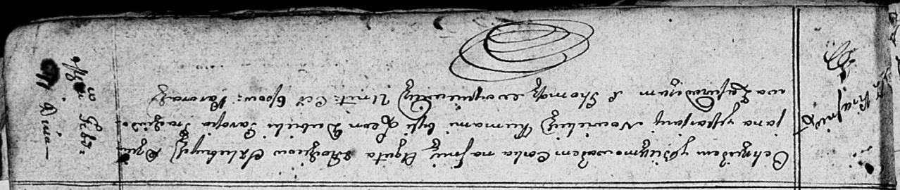
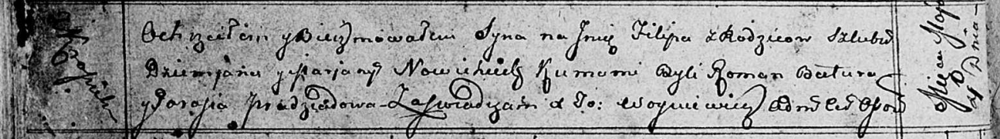

**Новицкий Демьян (Nowicki Dziemjan)**

11 февраля 1811 г -- крещение дочери Агаты (НИАБ 136-13-894, лист 80,
№10/1811-р (ориг)).

4 мая 1813 г -- крещение сына Филипа (НИАБ 136-13-894, лист 86об,
№13/1813-р (ориг)).

**НИАБ 136-13-894:** Лист 80. **Метрическая запись №10/1811-р (ориг).**

Осовская Покровская церковь. 11 февраля 1811 года. Метрическая запись о
крещении.

Nowicka Agata -- дочь родителей с деревни Красники.

Nowicki Dziemjan -- отец.

Nowicka Marjana -- мать.

Dubicki Leon -- кум.

Pradziadowa Parasia -- кума.

Woyniewicz Tomasz -- ксёндз.

**НИАБ 136-13-894:** Лист 86об. **Метрическая запись №13/1813-р
(ориг).**

Осовская Покровская церковь. 4 мая 1813 года. Метрическая запись о
крещении.

Nowicki Filip -- сын родителей с деревни Красники.

Nowicki Dziemjan -- отец.

Nowicka Marjana -- мать.

Batura Roman -- кум.

Pradziadowa Parasia -- кума.

Woyniewicz Tomasz -- ксёндз.
