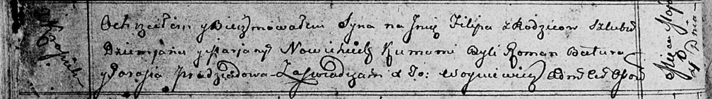

**Новицкий Филип Демьянов (Nowicki Filip)**

4 мая 1813 г -- крещение (НИАБ 136-13-894, лист 86об, №13/1813-р
(ориг)).

**НИАБ 136-13-894:** Лист 86об. **Метрическая запись №13/1813-р
(ориг).**

Осовская Покровская церковь. 4 мая 1813 года. Метрическая запись о
крещении.

Nowicki Filip -- сын родителей с деревни Красники.

Nowicki Dziemjan -- отец.

Nowicka Marjana -- мать.

Batura Roman -- кум.

Pradziadowa Parasia -- кума.

Woyniewicz Tomasz -- ксёндз.
