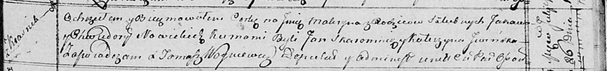

**Новицкий Яков (Nowicki Jakow)**

26 июля 1814 г -- крещение дочери Макрыны (НИАБ 136-13-894, лист 90,
№46/1814-р (ориг)).

**НИАБ 136-13-894:** Лист 90. **Метрическая запись №46/1814-р (ориг).**

Осовская Покровская церковь. 26 июля 1814 года. Метрическая запись о
крещении.

Nowicka Makryna -- дочь родителей с деревни Красники.

Nowicki Jakow -- отец.

Nowicka Chwiedora -- мать.

Skaromnik Jan -- кум.

Jwińska Katerzyna -- кума.

Woyniewicz Tomasz -- ксёндз.
