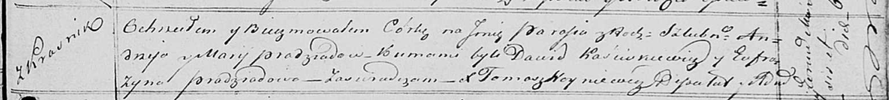

**Прадед Парася Андреева (Pradziadowna Parasia)**

6 июня 1820 г -- крещение (НИАБ 136-13-894, лист 104, №18/1820-р
(ориг)).

**НИАБ 136-13-894:** Лист 104. **Метрическая запись №18/1820-р (ориг).**

{width="6.496527777777778in"
height="0.7388965441819773in"}

Осовская Покровская церковь. 6 июня 1820 года. Метрическая запись о
крещении.

Pradziadowna Parasia -- дочь родителей с деревни Красники.

Pradziad Andrzey -- отец.

Pradziadowa Marija -- мать.

Kaściukewicz Dawid -- кум.

Pradziadowa Eufrozyna -- кума.

Woyniewicz Tomasz -- ксёндз.
