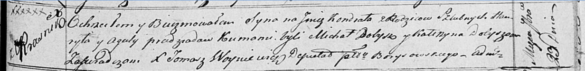

**Прадед Кондрат Гаврылов (Pradziad Kondrat)**

23 сентября 1817 г -- крещение (НИАБ 136-13-894, лист 97, №55/1817-р
(ориг)).

**НИАБ 136-13-894:** Лист 97. **Метрическая запись №55/1817-р (ориг).**

{width="6.496527777777778in"
height="0.7965605861767279in"}

Осовская Покровская церковь. 23 сентября 1817 года. Метрическая запись о
крещении.

Pradziad Kondrat -- сын родителей с деревни Красники.

Pradziad Hauryła -- отец.

Pradsiadowa Agata -- мать.

Dobysz Michał -- кум.

Dobyszowa Katerzyna -- кума.

Woyniewicz Tomasz -- ксёндз.
