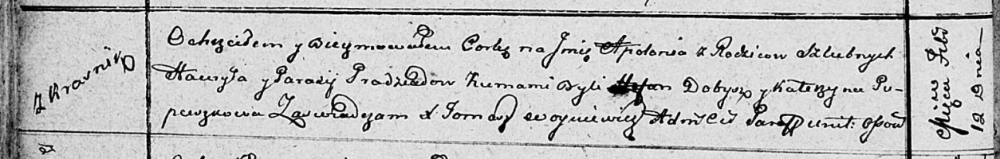

**Прадед Парася (Pradziadowa Parasija)**

12 февраля 1812 г -- крещение дочери Аполонии (НИАБ 136-13-894, лист
83об, №10/1812-р (ориг)).

**НИАБ 136-13-894:** Лист 83об. **Метрическая запись №10/1812-р
(ориг).**

Осовская Покровская церковь. 12 февраля 1812 года. Метрическая запись о
крещении.

Pradziadowna Apołonia -- дочь родителей с деревни Красники.

Pradziad Hauryła -- отец.

Pradziadowa Parasija -- мать.

Dobysz Stefan -- кум.

Pupuszkowa Katerzyna -- кума.

Woyniewicz Tomasz -- ксёндз.
