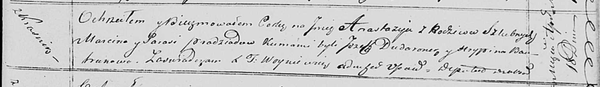

**Прадед Анастасия Марцинова (Pradziadowna Anastazija)**

18 апреля 1820 г -- крещение (НИАБ 136-13-894, лист 104, №12/1820-р
(ориг)).

**НИАБ 136-13-894:** Лист 104. **Метрическая запись №12/1820-р (ориг).**

{width="6.496527777777778in"
height="0.9434011373578303in"}

Осовская Покровская церковь. 18 апреля 1820 года. Метрическая запись о
крещении.

Pradziadowna Anastazija -- дочь родителей с деревни Красники.

Pradziad Marcin -- отец.

Pradziadowa Parasia -- мать.

Dudaronek Jozef -- кум.

Bautrukowa Hrypina -- кума.

Woyniewicz Tomasz -- ксёндз.
