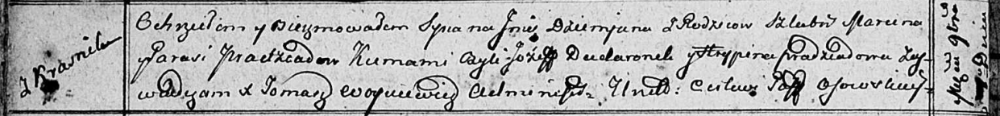
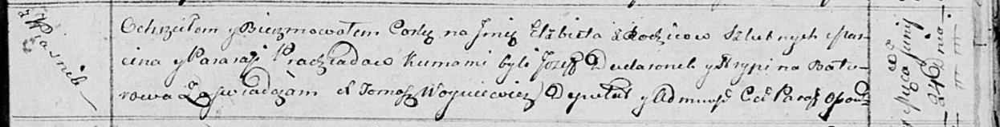

**Прадед Елисавета Марцинова (Pradziadowna Elżbieta)**

24 июня 1814 г -- крещение (НИАБ 136-13-894, лист 90, №39/1814-р
(ориг)).

**НИАБ 136-13-894:** Лист 85об. **Метрическая запись №51/1812-р
(ориг).**

Осовская Покровская церковь. \[\] ноября 1812 года. Метрическая запись о
крещении.

Pradziad Dziemjan -- сын родителей с деревни Красники.

Pradziad Marcin -- отец.

Pradziadowa Parasia -- мать.

Dudaronek Jozef -- кум.

Pradziadowa Hrypina -- кума.

Woyniewicz Tomasz -- ксёндз.

**НИАБ 136-13-894:** Лист 90. **Метрическая запись №39/1814-р (ориг).**

Осовская Покровская церковь. 24 июня 1814 года. Метрическая запись о
крещении.

Pradziadowna Elżbieta -- дочь родителей с деревни Красники.

Pradziad Marcin -- отец.

Pradziadowa Paraska -- мать.

Dudaronek Jozef -- кум.

Baturowa Hrypina -- кума.

Woyniewicz Tomasz -- ксёндз.
