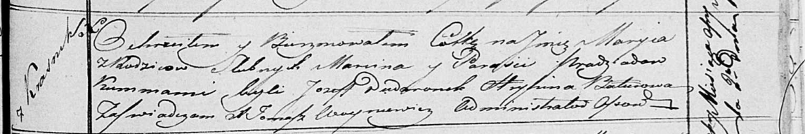

**Прадед Марыя Марцинова (Pradziadowna Maryia)**

2 апреля 1817 г -- крещение (НИАБ 136-13-894, лист 96, №25/1817-р
(ориг)).

**НИАБ 136-13-894:** Лист 96. **Метрическая запись №25/1817-р (ориг).**

Осовская Покровская церковь. 2 апреля 1817 года. Метрическая запись о
крещении.

Pradziadowna Maryia -- дочь родителей с деревни Красники.

Pradziad Marcin -- отец.

Pradziadowa Parasija -- мать.

Dudaronek Jozef -- кум.

Baturowa Hrypina -- кума.

Woyniewicz Tomasz -- ксёндз.
