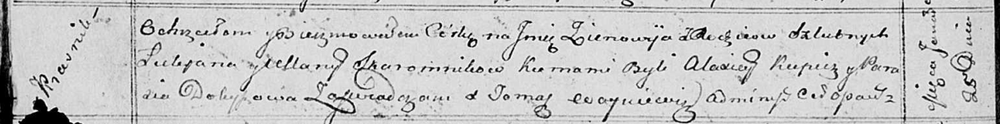

**Скаромник Лукьян (Skaromnik Łukjan)**

25 января 1814 г -- крещение дочери Зеновии (НИАБ 136-13-894, лист 88об,
№6/1814-р (ориг)).

**НИАБ 136-13-894:** Лист 88об. **Метрическая запись №6/1814-р (ориг).**

{width="6.496527777777778in"
height="0.8072889326334208in"}

Осовская Покровская церковь. 25 января 1814 года. Метрическая запись о
крещении.

Skaromnikowna Zienowija -- дочь родителей с деревни Красники.

Skaromnik Łukjan -- отец.

Skaromnikowa Ullana -- мать.

Kupicz Alaxiey -- кум.

Dobyszowa Parasia -- кума.

Woyniewicz Tomasz -- ксёндз.
