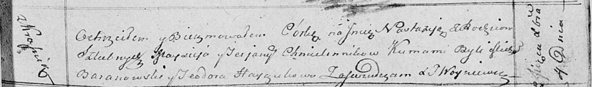

**Хмелинник Татьяна (Chmielinnikowa Teciana)**

4 декабря 1813 г -- крещение дочери Настасьи (НИАБ 136-13-894, лист 88,
№42/1813-р (ориг)).

**НИАБ 136-13-894:** Лист 88. **Метрическая запись №42/1813-р (ориг).**

Осовская Покровская церковь. 4 декабря 1813 года. Метрическая запись о
крещении.

Chmielinnikowna Nastazija -- дочь родителей с деревни Красники.

Chmielinnik Maysiey -- отец.

Chmielinnikowa Teciana -- мать.

Baranowski Michał -- кум.

Hayczukowa Teodora -- кума.

Woyniewicz Tomasz -- ксёндз.
