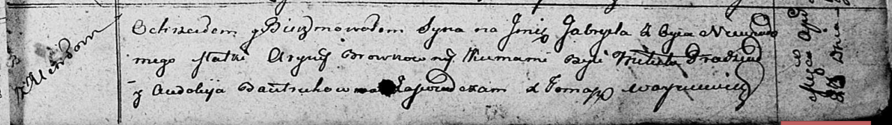

**Бровко Гаврыла (Browko Gabriel)**

30 марта 1812 г -- крещение (НИАБ 136-13-894, лист 84, №24/1812-р
(ориг)).

**НИАБ 136-13-894:** Лист 84. **Метрическая запись №24/1812-р (ориг).**

Осовская Покровская церковь. 30 марта 1812 года. Метрическая запись о
крещении.

Browka Gabriel -- незаконнорожденный сын с деревня Углы.

Browkowna Aryna -- мать.

Pradziad Mikita -- кум.

Bautrukowna Audokija -- кума.

Woyniewicz Tomasz -- ксёндз.
