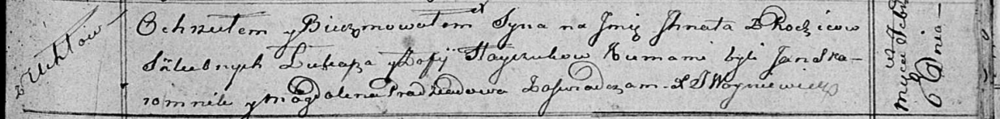

**Гайчук Игнат Лукин (Hayczuk Jhnat)**

6 февраля 1816 г -- крещение (НИАБ 136-13-894, лист 93, №2/1816-р
(ориг)).

**НИАБ 136-13-894:** Лист 93. **Метрическая запись №2/1816-р (ориг).**

{width="6.496527777777778in"
height="0.7784569116360455in"}

Осовская Покровская церковь. 6 февраля 1816 года. Метрическая запись о
крещении.

Hayczuk Jhnat -- дочь родителей с деревни Углы.

Hayczuk Łukasz -- отец.

Hayczukowa Zofija -- мать.

Skaromnik Jan -- кум.

Pradziadowa Magdalena -- кума.

Woyniewicz Tomasz -- ксёндз.
