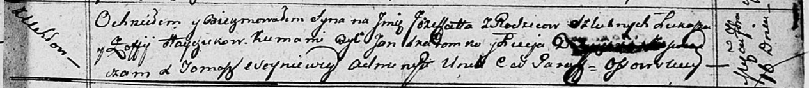

**Гайчук Лука (Hayczuk Łukasz)**

17 сентября 1811 г -- крещение сына Микиты (НИАБ 136-13-894, лист 82,
№46/1811-р (ориг)).

16 сентября 1812 г -- крещение сына Ёзефата (НИАБ 136-13-894, лист 85,
№43/1812-р (ориг)).

6 февраля 1816 г -- крещение сына Игната (НИАБ 136-13-894, лист 93,
№2/1816-р (ориг)).

**НИАБ 136-13-894:** Лист 82. **Метрическая запись №46/1811-р (ориг).**

Осовская Покровская церковь. 17 сентября 1811 года. Метрическая запись о
крещении.

Hayczuk Mikita -- сын родителей с деревни Углы.

Hayczuk Łukasz -- отец.

Hayczukowa Zofija? -- мать.

Skaromnik Jan -- кум.

Doboszowna Lucija -- кума.

Woyniewicz Tomasz -- ксёндз.

**НИАБ 136-13-894:** Лист 85. **Метрическая запись №43/1812-р (ориг).**

Осовская Покровская церковь. 16 сентября 1812 года. Метрическая запись о
крещении.

Hayczuk Jozefat -- сын родителей с деревни Углы.

Hayczuk Łukasz -- отец.

Hayczukowa Zofija -- мать.

Skaromko Jan -- кум.

D\... Luceja -- кума.

Woyniewicz Tomasz -- ксёндз.

**НИАБ 136-13-894:** Лист 93. **Метрическая запись №2/1816-р (ориг).**

Осовская Покровская церковь. 6 февраля 1816 года. Метрическая запись о
крещении.

Hayczuk Jhnat -- дочь родителей с деревни Углы.

Hayczuk Łukasz -- отец.

Hayczukowa Zofija -- мать.

Skaromnik Jan -- кум.

Pradziadowa Magdalena -- кума.

Woyniewicz Tomasz -- ксёндз.
