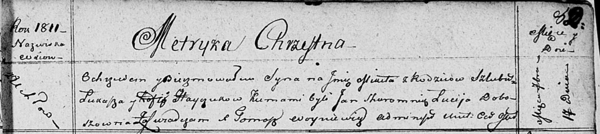

**Гайчук Микита Лукин (Hayczuk Mikita)**

17 сентября 1811 г -- крещение (НИАБ 136-13-894, лист 82, №46/1811-р
(ориг)).

**НИАБ 136-13-894:** Лист 82. **Метрическая запись №46/1811-р (ориг).**

Осовская Покровская церковь. 17 сентября 1811 года. Метрическая запись о
крещении.

Hayczuk Mikita -- сын родителей с деревни Углы.

Hayczuk Łukasz -- отец.

Hayczukowa Zofija? -- мать.

Skaromnik Jan -- кум.

Doboszowna Lucija -- кума.

Woyniewicz Tomasz -- ксёндз.
