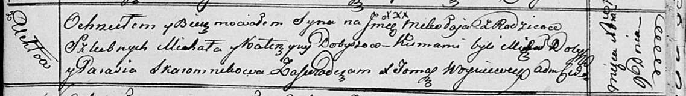

**Добыш Михал (Dobyrz Michał)**

30 октября 1810 г -- крещение сына Якуба (НИАБ 136-13-894, лист 79об,
№54/1810-р (ориг)).

9 декабря 1816 г -- крещение сына Миколая (НИАБ 136-13-894, лист 95,
№42/1816-р (ориг)).

**НИАБ 136-13-894:** Лист 79об. **Метрическая запись №54/1810-р
(ориг).**

{width="6.496527777777778in"
height="1.6367038495188102in"}

Осовская Покровская церковь. 30 октября 1810 года. Метрическая запись о
крещении.

Dobyrz Jakub -- сын родителей с деревни Углы.

Dobyrz Michał -- отец.

Dobyrzowa Katerzyna -- мать.

Hayczuk Łukasz -- кум.

Skaromnikowa Parasia -- кума.

Woyniewicz Tomasz -- ксёндз.

**НИАБ 136-13-894:** Лист 95. **Метрическая запись №42/1816-р (ориг).**

{width="6.496527777777778in"
height="0.9138987314085739in"}

Осовская униатская церковь. 9 декабря 1816 года. Метрическая запись о
крещении.

Dobysz Mikołay -- сын родителей с деревни Углы.

Dobysz Michał -- отец.

Dobyszowa Katerzyna -- мать.

Dobysz Michał -- кум.

Skaromnikowa Parasia -- кума.

Woyniewicz Tomasz -- ксёндз.
