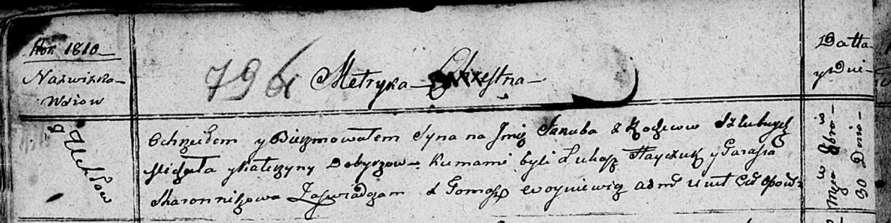

**Добыш Якуб Михалов (Dobyrz Jakub)**

30 октября 1810 г -- крещение (НИАБ 136-13-894, лист 79об, №54/1810-р
(ориг)).

**НИАБ 136-13-894:** Лист 79об. **Метрическая запись №54/1810-р
(ориг).**

Осовская Покровская церковь. 30 октября 1810 года. Метрическая запись о
крещении.

Dobyrz Jakub -- сын родителей с деревни Углы.

Dobyrz Michał -- отец.

Dobyrzowa Katerzyna -- мать.

Hayczuk Łukasz -- кум.

Skaromnikowa Parasia -- кума.

Woyniewicz Tomasz -- ксёндз.
