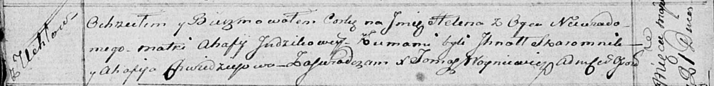

**Ендзик, Юдзик Агафия (Judzikowa Ahafija)**

21 мая 1816 г -- крещение незаконнорожденной дочери Елены (НИАБ
136-13-894, лист 93об, №12/1816-р (ориг)).

**НИАБ 136-13-894:** Лист 93об. **Метрическая запись №12/1816-р
(ориг).**

Осовская Покровская церковь. 21 мая 1816 года. Метрическая запись о
крещении.

Helena -- незаконнорожденная дочь с деревни Углы.

Judzikowa Ahafija -- мать.

Skaromnik Jhnat -- кум.

Chwedziejowa Ahafija -- кума.

Woyniewicz Tomasz -- ксёндз.
