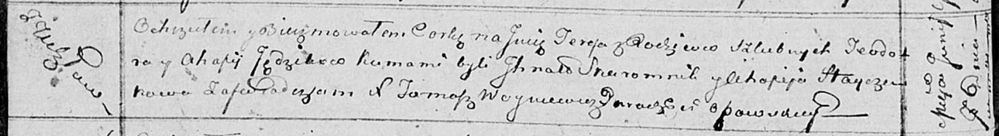

**Ендзик Тодор (Ędzik Teodor)**

7 июня 1814 г -- крещение дочери Тересы (НИАБ 136-13-894, лист 89об,
№34/1814-р (ориг)).

**НИАБ 136-13-894:** Лист 89об. **Метрическая запись №34/1814-р
(ориг).**

Осовская Покровская церковь. 7 июня 1814 года. Метрическая запись о
крещении.

Jędzikowna Teresa -- дочь родителей с деревни Углы.

Jędzik Teodor -- отец.

Jędzikowa Ahafija -- мать.

Skaromnik Jhnat -- кум.

Hayczukowa Ahafija -- кума.

Woyniewicz Tomasz -- ксёндз.
