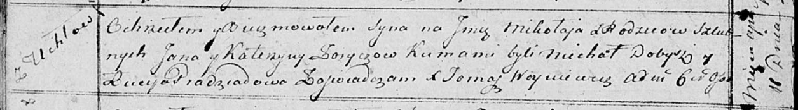

**Зорич Миколай Янов (Zorycz Mikołay)**

11 апреля 1815 г -- крещение (НИАБ 136-13-894, лист 92об, №23/1815-р
(ориг)).

**НИАБ 136-13-894:** Лист 92об. **Метрическая запись №23/1815-р
(ориг).**

Осовская Покровская церковь. 11 апреля 1815 года. Метрическая запись о
крещении.

Zorycz Mikołay -- сын родителей с деревни Углы.

Zorycz Jan -- отец.

Zoryczowa Katerzyna -- мать.

Dobysz Michał -- кум.

Pradziadowa Lucija -- кума.

Woyniewicz Tomasz -- ксёндз.
