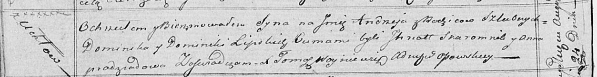

**Липский Андрей Домиников (Lipski Andrzey)**

24 августа 1819 г -- крещение (НИАБ 136-13-894, лист 101об, №45/1819-р
(ориг)).

**НИАБ 136-13-894:** Лист 101об. **Метрическая запись №45/1819-р
(ориг).**

{width="6.496527777777778in"
height="0.8502012248468941in"}

Осовская Покровская церковь. 24 августа 1819 года. Метрическая запись о
крещении.

Lipski Andrzey -- сын родителей с деревни Углы.

Lipski Dominik -- отец.

Lipska Dominika -- мать.

Skaromnik Jhnat -- кум.

Pradziadowa Anna -- кума.

Woyniewicz Tomasz -- ксёндз.
