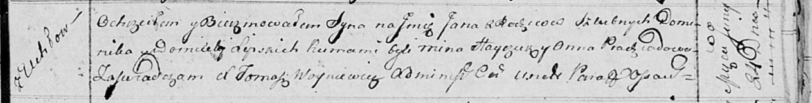

**Липский Ян Домиников (Lipski Jan)**

24 июня 1814 г -- крещение (НИАБ 136-13-894, лист 90, №40/1814-р
(ориг)).

**НИАБ 136-13-894:** Лист 90. **Метрическая запись №40/1814-р (ориг).**

{width="6.496527777777778in"
height="0.8334383202099738in"}

Осовская Покровская церковь. 24 июня 1814 года. Метрическая запись о
крещении.

Lipski Jan -- сын родителей с деревни Углы.

Lipski Dominik -- отец.

Lipska Domicela -- мать.

Hayczuk Mina -- кум.

Pradziadowa Anna -- кума.

Woyniewicz Tomasz -- ксёндз.
