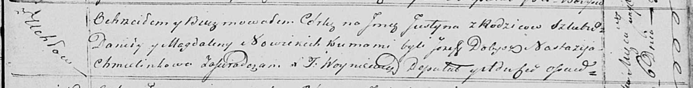

**Новицкий Юстына Данилова (Nowicka Justyna)**

6 июня 1820 г -- крещение (НИАБ 136-13-894, лист 104, №17/1820-р
(ориг)).

**НИАБ 136-13-894:** Лист 104. **Метрическая запись №17/1820-р (ориг).**

{width="6.496527777777778in"
height="0.8300853018372704in"}

Осовская Покровская церковь. 6 июня 1820 года. Метрическая запись о
крещении.

Nowicka Justyna -- дочь родителей с деревни Углы.

Nowicki Daniła -- отец.

Nowicka Magdalena -- мать.

Dobysz Jozef -- кум.

Chmielinkowa Nastazija -- кума.

Woyniewicz Tomasz -- ксёндз.
