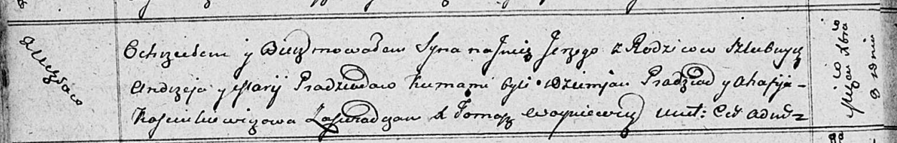

**Прадед Марыя (Pradziadowa Marija)**

8 декабря 1811 г -- крещение сына Юрия (НИАБ 136-13-894, лист 82об,
№62/1811-р (ориг)).

**НИАБ 136-13-894:** Лист 82об. **Метрическая запись №62/1811-р
(ориг).**

{width="6.496527777777778in"
height="1.0419652230971128in"}

Осовская Покровская церковь. 8 декабря 1811 года. Метрическая запись о
крещении.

Pradziad Jerzy -- сын родителей с деревни Углы.

Pradziad Andrzey -- отец.

Pradziadowa Marija -- мать.

Pradziad Dziemjan -- кум.

Kasciukiewiczowa Ahafija -- кума.

Woyniewicz Tomasz -- ксёндз.
